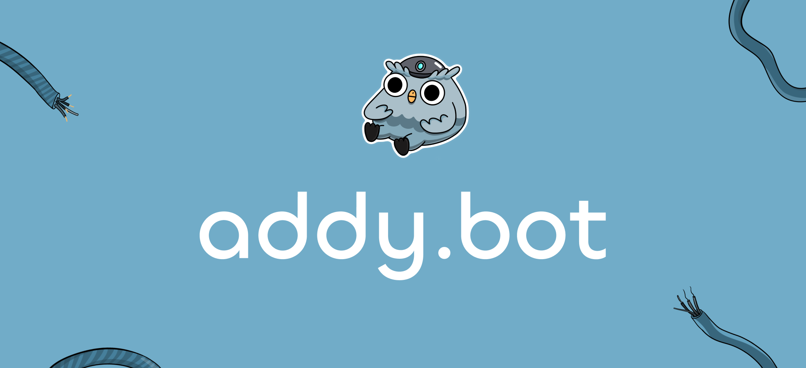

# AddyToken - Addy.bot ERC20 Smart Contract

Welcome to the official GitHub repository for the AddyToken, the core ERC20 token powering the Addy.bot ecosystem. AddyToken ($ADDY) is designed to revolutionize the advertising industry, offering a unique blend of rewards, staking, and governance features within the Addy.bot platform. This repository hosts the smart contract codebase for $ADDY, aimed at developers, auditors, and enthusiasts interested in the technical foundations of our project.

## Overview

Addy.bot introduces a groundbreaking approach to advertising on Telegram, enabling community owners to monetize their channels and users to earn by spreading the word about ads. The AddyToken lies at the heart of this ecosystem, facilitating transactions, rewards, and governance.

## Features

- **ERC20 Compliance**: Ensures compatibility with the broad Ethereum ecosystem, including exchanges, wallets, and other DeFi applications.
- **Staking Mechanism**: Holders can stake $ADDY tokens to receive a share of the advertising revenue, promoting long-term holding and ecosystem stability.
- **Community Governance**: Token holders can participate in governance decisions, influencing the direction and policies of the Addy.bot platform.
- **Ad Revenue Sharing**: A unique model that rewards community owners and users for their participation and contribution to the ecosystem.

## Contract Specifications

- **Token Name**: AddyToken
- **Symbol**: $ADDY
- **Decimals**: 18
- **Network**: Ethereum Mainnet
- **Smart Contract Language**: Solidity

## Getting Started

To interact with the AddyToken contract or integrate it into your project, follow these steps:

1. **Installation**

Clone this repository to your local machine using Git:

```bash
git clone https://github.com/Addy-Bot-AI/addy.contracts
